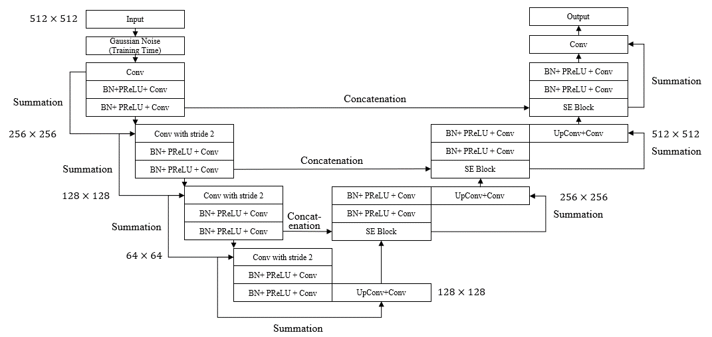

# Implementation of deep learning framework -- Attention UNet

The architecture was inspired by Attention-guided version of 2D UNet for automatic brain tumor segmentation.

## Overview
This repository contains an unofficial implementation of Attention U-Net using PyTorch.<br/>
Please refer to the paper at the following page: 
[Attention-Guided Version of 2D UNet for Automatic Brain Tumor Segmentation](https://ieeexplore.ieee.org/document/8964956?denie] "Visit")

## Model

## Paper
If you use this software for your research, please cite:

```bibtex
@inproceedings{noori2019attention,
  title={Attention-guided version of 2D UNet for automatic brain tumor segmentation},
  author={Noori, Mehrdad and Bahri, Ali and Mohammadi, Karim},
  booktitle={2019 9th international conference on computer and knowledge engineering (ICCKE)},
  pages={269--275},
  year={2019},
  organization={IEEE}
}
```

## License
This program is available for download for non-commercial use, licensed under the GNU General Public License. This allows its use for research purposes or other free software projects but does not allow its incorporation into any type of commercial software.

## Files
The repository contains the following files:

- `model.py`: Python script file, containing the PyTorch implementation of the Attention UNet.
- `README.md`: Markdown file explaining the model source code.
